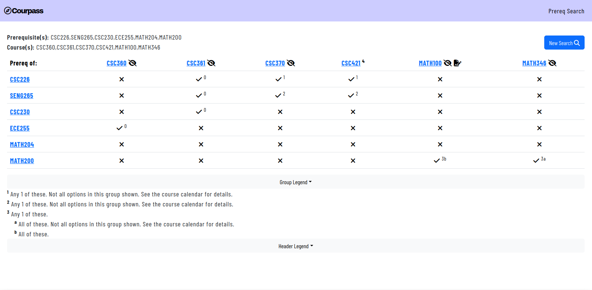

# Courpass
Easily visualize UVic course prerequisites.

[](https://www.johnnyw.ca/jenkins/job/academic-calendar-scraper/job/calendar-scrape-regression/job/main/)



**Please note that this project is no longer operational in its current state,
as the underlying UVic webpages it relied on have since been deprecated.**

# Prerequisites
You will need a Python environment with the packages as specified in the
`requirements.txt` file installed. Creating a `venv` to manage this environment
is recommended, but not necessary.

# Run
## Django webserver
To launch the Django server for local development, navigate to the `academic_calendar_scraper/academic_calendar_scraper` directory. From there, you can run the following command:

```
$ python3 manage.py runserver
```

The above command will output some status information. You will likely see a message regarding "18 unapplied migration(s)," as mentioned in the docs [here](https://docs.djangoproject.com/en/4.2/intro/tutorial01/); they can be ignored at this time.

You will find the server running [here](http://127.0.0.1:8000/); note, the local development url is also given as part of the above command's output.

## Command-line usage

Within the root directory, there is a main.py file which can be used to generate a text-based prerequisite grid. Basic usage is as follows:

```bash
$ python3 -O main.py <LIST_OF_COURSES_TO_SEARCH> <LIST_OF_PREREQS_TO_FIND>
```
where `LIST_OF_COURSES_TO_SEARCH` and `LIST_OF_PREREQS_TO_FIND` are comma-separated lists. For example:

```bash
$ python3 -O main.py CSC360,CSC361,CSC370,CSC421,MATH100,MATH346 CSC226,SENG265,CSC230,ECE255,MATH120,MATH204,MATH200
Prereq of: CSC360*   CSC361*   CSC370*   CSC421⁴  MATH100*+  MATH346* 
    CSC226    ✗         C         ✗         ✓         ✗         ✗     
   SENG265    ✓         ✓         ✓         ✗         ✗         ✗     
    CSC230    ✓¹        ✓²        ✗         ✗         ✗         ✗     
    ECE255    ✓¹        ✓²        ✗         ✗         ✗         ✗     
   MATH120    ✗         ✗         ✗         ✗        ✓³¹        ✗     
   MATH204    ✗         ✗         ✗         ✗         ✗        ✓⁴²    
   MATH200    ✗         ✗         ✗         ✗         ✗        ✓⁴¹    
-----------
Header legend:
     ²³⁴⁵: Minimum year standing required.
        *: Not all prereqs shown. See calendar for details.
        +: Or department permission.
-----------
Grid legend:
 ✓: Prerequsite, C: Corequisite, ✗: Not a co/prequisite
        1: Any 1 of these. Not all options in this group shown. See calendar for details.
        2: Any 1 of these. Not all options in this group shown. See calendar for details.
        3: Any 1 of these. Not all options in this group shown. See calendar for details.
              3 1: All of these. Minimum grade of C+ required.
        4: Any 1 of these.
              4 1: All of these. Not all options in this group shown. See calendar for details.
              4 2: All of these.
```

To enable debugging output, remove the `-O` argument from the launch command.


# Deploy
Deployment largely follows the standard Django deployment steps, which will vary
depending on your exact setup. We deployed the `courpass.ca` website using
`apache2` with `mod_wsgi` on an Ubuntu 22.04 server. 

A good guide
that discusses hosting Django using `apache2` and `mod_wsgi` is available [here](https://docs.djangoproject.com/en/5.0/howto/deployment/wsgi/modwsgi/).
When configuring your server, note that `academic_calendar_scraper/` is the root
of the Django directory in this repo.

Note that since we use the Font Awesome Free icons, you will need to make sure to
serve these icons in your deployment. In our case, we needed to add the following
line to our `apache2` site configuration:

```
Alias /courpass/static/fontawesomefree "/var/www/courpass-venv/lib/python3.10/site-packages/fontawesomefree/static/fontawesomefree"
```

Again, this step may vary depending on your exact setup.
